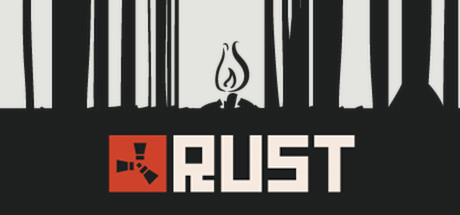

# Rust



## System requirements

* RAM: 4GB-12GB, Increases depending upon map size
* CPU: Dual core 3.4GHz
* Bandwidth: 10mbps upload

## Useful Links

### General Information

[https://developer.valvesoftware.com/wiki/Rust\_Dedicated\_Server](https://developer.valvesoftware.com/wiki/Rust_Dedicated_Server)

### RustAdmin

Server RCON administration tool  
[https://www.rustadmin.com/](https://www.rustadmin.com/)

### Online Rcon tool by Facepunch

[https://facepunch.github.io/webrcon/](https://facepunch.github.io/webrcon/)

## Wipe

A server wipe is used to reset a Rust server by deleting certain types of data about the map and players.


A wipe will keep the Rust+ data intact.


### Map Wipe

A map wipe will remove all the player-made buildings and resources. Resetting the map back to its original state. However, a player's blueprints will be retained.

```bash
./rustserver map-wipe
```

### Full Wipe

A full wipe will remove all the player-made buildings, resources _**and**_ all player's blueprints.

```bash
./rustserver full-wipe
```

### Automated Wipe

Using [cron](../configuration/cronjobs.md) it is possible to automate your server wipes. The below example will wipe the server every Sunday night at midnight.

```bash
0 0 * * 0 /home/rustserver/rustserver map-wipe > /dev/null 2>&1
```

### Random Seed

If the Rust server is using the _Procedural Map_ and a seed is not set in the config when the wipe commands will set a new random seed.

```text
seed=""
```

## Install Oxide

Oxide is an API allowing you to run mods for your Rust server.

LinuxGSM now handles the install of Oxide for Rust, with `mods-install` and `mods-update` commands.

```bash
./rustserver mods-install
```

If a Rust update has been released, then an Oxide update will soon follow. To update Oxide, you can then run:

```bash
./rustserver mods-update
```

### Install Oxide addons

To install Oxide addons place them into the `serverfiles/oxide/plugins` directory. This will cause them to load automatically when starting the server.

If you need to edit any addon configs, they will be located in `serverfiles/oxide/config`.

To update an addon without restarting the server, you'll need to reload the addon with an RCON command.

```text
oxide.reload PluginName
```

## RCON

### Send RCON commands:

RCON is the protocol used to send commands to your server. You will need a tool to use it. Here are 3 of them:

* Rusty: [http://oxidemod.org/resources/rusty-server-rcon-administration-tool.53/](http://oxidemod.org/resources/rusty-server-rcon-administration-tool.53/)
* Rustadmin: [https://www.rustadmin.com/](https://www.rustadmin.com/) \(supports both rconweb=1 and rconweb=0\)
* Facepunch web tool: [http://facepunch.github.io/webrcon/\#/home](http://facepunch.github.io/webrcon/#/home)

To use software like Rusty, you need to alter LinuxGSM config and change `rconweb="0"`. To use Facepunch tool, Rustadmin desktop or Rustadmin Online, you can leave it at default `rconweb="1"`

> Note: Facepunch web tool currently don't accept domain names, you need to enter server IP.

### Essential RCON Commands

```text
save ; will save the server state (useful before a stop or restart)
oxide.reload PluginName ; will reload a plugin after updating it
ownerid STEAMID64 "Nickname" "Reason" ; to add an owner
moderatorid STEAMID64 "Nickname" "Reason" ; to add a moderator
server.writecfg ; will save config changes, including new admins
```

> Note: append `server.writecfg` after adding an admin, and player needs to reconnect the server in order for it to be applied.

