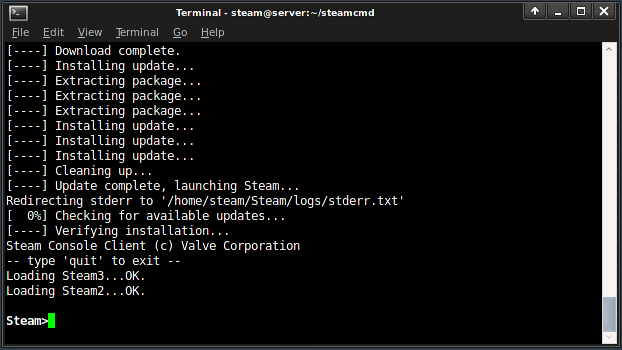
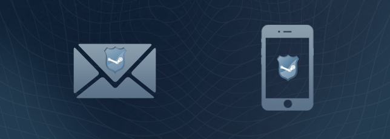

# SteamCMD

## SteamCMD

SteamCMD is a command-line based Steam client developed by Valve that is used to remotely download game files. This is very useful for game servers, as it is significantly easier to keep them up-to-date. Any game that supports dedicated servers will have their server files available on SteamCMD. All you need is the AppID which can be found on Valve's [wiki](https://developer.valvesoftware.com/wiki/Dedicated_Servers_List) or [SteamDB](https://steamdb.info/search/?a=app&q=server).


You can only download server files for the operating system that you are using SteamCMD on.




### SteamCMD Login

SteamCMD requires a login to download some game servers.

It is recommended that you [create a new Steam username](https://store.steampowered.com/login/) just for the server.

#### Anonymous Login

The majority of game servers using SteamCMD only require an _anonymous_ login. LinuxGSM will not require any configuration if this is the case.

#### Steam User Login

Some game servers require you login to SteamCMD using a steam login to allow download of the server. Some also require you to own a copy of the game on the steam account.

If this is the case LinuxGSM will prompt you on install to set a steam _username_ and _password._ This __can be set by editing the following settings within the [LinuxGSM config](../configuration/linuxgsm-config.md).

```text
## SteamCMD Login
steamuser="username"
steampass="password"
```


 Do not use your own steam login. Create a new Steam login just for the game server. As the steam login password is stored in [plain text](./#plain-text-passwords).



Check [here](https://linuxgsm.com/data/steamcmd) for a list of game servers that require a login.


#### Plain Text Passwords

SteamCMD prints out passwords in plain text meaning that the Steam login password is visible to anyone on the server. LinuxGSM saves logs and the Steam login password will be view-able in the logs.

### Steam Guard



Steam Guard is an additional layer of security that can be applied to a Steam account. The first layer is the account login credentials: the Steam account username and password. With Steam Guard, a second layer of security is applied to the account, making it harder for a Steam account to fall into the wrong hands.

When Steam Guard is enabled on an account, when a login to from an unrecognized device happens an access code will be required as verification. Depending on the account Steam Guard settings, either an email with a code or a code from the Steam Mobile app on a smartphone is required.


For more info visit [steam support](https://support.steampowered.com/kb_article.php?ref=4020-ALZM-5519).


#### Authentication Methods for SteamCMD

1. Username and password - No Steam Guard
2. Username and password - Steam Guard via Email \(recommended\)
3. Username and password - Steam Guard via Smartphone \(not compatible with LinuxGSM\)

**Username and Password - No Steam Guard**

Simply requires your Steam username and password.

**Username and Password - Steam Guard via Email \(recommended\)**

Requires your Steam username and password but also you will receive and email on first login to SteamCMD and be required to enter a code. Once the code is entered your server is authorised to use the steam account you entered.

**Username and Password - Steam Guard via Smartphone \(not compatible with LinuxGSM\)**

Requires your Steam Username & Password but also requires you have the Steam app on your phone to use 2-factor Authentication

#### Using Steam Guard with LinuxGSM

Both options 1 & 2 work with LinuxGSM.

Steam Guard via Smartphone is not compatible because it requires a code every time you login to SteamCMD. This is problematic if you want your servers to auto update.

If you have Steam Guard via email enabled the first time you start SteamCMD you will be prompt to enter a steam Guard code and receive an email with the code. Copy and paste the code in to the prompt and press enter. You will not need to enter a code again.

### Errors

If you encounter an error like

`Error! App '<app_number>' state is 0x202 after update job.`

there is a good chance that you have run out of disk space.

## Game Server Login Token

Game Server Login Token is a new system by Valve for managing game servers.

### Games using GSLT

* Ballistic Overkill
* Brainbread 2
* Black Mesa: Deathmatch
* Counter Strike: Global Offensive \(**required**\)
* Counter Strike: Source \(**required**\)
* Day of Defeat: Source
* Empires Mod
* Garry’s Mod
* Insurgency
* No more Room in Hell \(**required**\)
* Team Fortress 2
* Tower Unite
* Zombie Panic! Source

### What is GSLT?

GSLT creates a persistent token for a game server. This allows any users who have a game server as a favourite the server if you to change your servers IP details. This is very useful if you change your server/hosting provider. Allowing your regular players to easily connect to your new server.

To fully understand the reasoning behind GSLT, we need to back up a bit to July 2015. [Valve announced that running certain plugins would get your server blacklisted](http://dathost.net/blog/important-information-regarding-our-csgo-servers/), meaning it could not connect to the master servers and people wouldn’t be able to connect to the server.

This created a lot of problems for game server providers, large communities and anyone providing configurable servers to third parties, as bans were handed out by IP, meaning that an entire machine could be banned because of one malicious or uninformed user.

To address this, Valve is moving the ban to account-level instead of IP-level, which means that the end-user is always responsible for what they run on their server. Of course, game server providers and the like still have a responsibility to educate their users on these policies, as some might mistakenly upload blacklisted plugins.

An added benefit is that people who add your server to favourite will still be able to find and connect to your server, even if you change hosting provider and/or the IP / port of your server. This was something that previously was impossible.

### Generate a Token

To generate a token follow this [link](http://steamcommunity.com/dev/managegameservers)

[http://steamcommunity.com/dev/managegameservers](http://steamcommunity.com/dev/managegameservers)


GSLT requires the app ID of the base game \(e.g. 440 for TF2, 730 for CS:GO, 4000 for Garry's Mod\) when generating a token, not the server appid



Every single server must use a unique GSLT.


### GSLT Server Parameter

GSLT can be registered on your server\(s\) by using the `sv_setsteamaccount` command either in _autoexec.cfg_ or from a _start parameter_.

start parameter

`+sv_setsteamaccount [token]`

autoexec.cfg

`sv_setsteamaccount [token]`

#### Tower Unite

Tower Unite has a command within its config file

`SteamLoginToken=`

### FAQ

#### If one of my tokens is banned/blacklisted, will all tokens be banned?

Yes, all of the tokens on your account will be blacklisted if one of your servers are found to be running a blacklisted plugin. Make sure you read up on Valve’s plugin policies before running a game server so nothing unfortunate happens to your tokens.

#### If my GSLT gets banned for running a blacklisted plugin, will my steam account be community and/or VAC banned?

Depending on the game Valve will punish the account that generated the token, On CS:GO you get a global cool down of 7 days \(you cannot join any community/valve server\) Most likely, it won’t be VAC banned, but Valve’s requirement that anyone creating GSLTs is not community banned, you may be community banned for running blacklisted plugins.

#### Can I use the same GSLT for multiple servers?

No. You must create a unique GSLT for each simultaneously running server.

#### Can I re-use GSLTs?

Yes, you can add your GSLT to a new server, you just can’t run two servers with the same GSLT, at the same time.

#### Do I still need a Steam WebAPI key to host workshop maps?

Unfortunately, despite registering a GSLT to your server, CS:GO servers will still need a Steam WebAPI key to host maps from the Workshop.

As of yet, no official confirmation has been made that TF2 servers will also require GSLTs, but they do support them so it’s not a wild guess that this is to come.

#### My server loses connection to the registered Steam account

Don’t use the same GSLT for multiple servers. When a server starts with a specific GSLT, it will disconnect any other servers already running that same GSLT. You need to create a unique GSLT for each server.

#### Is there a limit on how many GSLTs my account can have?

Yes, you can have a maximum of 1000 GSLTs on your account.

#### What are the requirements for my account to be able to create a GSLT?

Your Steam account must not be currently community banned or locked. Your Steam account must not be limited. Your Steam account must have a qualifying registered phone. Your Steam account must own the game for which you are creating a GSLT. Your Steam account may not have more than 1000 tokens.

Yes CS:GO is the only internet connected server that requires GSLT currently.

For further information see this useful blog post: [http://dathost.net/blog/important-information-regarding-our-csgo-servers/](http://dathost.net/blog/important-information-regarding-our-csgo-servers/)

