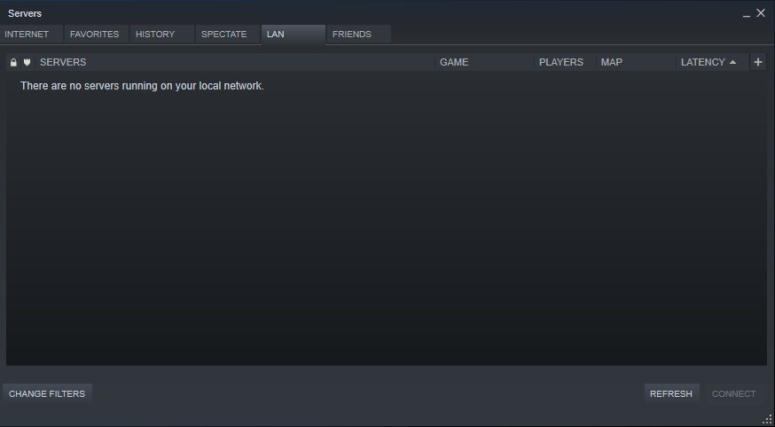

# LAN Discovery

Many admins who have tried, reported a local server does not appear on the LAN tab in the steam browser.



## Workarounds

### Console Command

Connect using the console command.

```text
connect IP:PORT
```

If the port is 27015, then you can just use : `connect IP`

```text
connect 192.168.1.10:27025
```

### Add server to favourites

Add the server to the server browser's favourites. If in-game, then go to the legacy browser if applicable to find it. The syntax to use is the same as for the console connection.


Make sure your server actually works and is reachable on LAN, otherwise what you need is rather [Troubleshooting](../support/troubleshooting.md) first.


## Fix

As [this github issue](https://github.com/GameServerManagers/LinuxGSM/issues/1770) shows, there might be a possible configuration that fixes the issue, but LinuxGSM devs were not able to reproduce it at the time of writing the doc, so this information is purely experimental and you are welcome to update it or post on the issue if you have useful information to share about it.

1. Edit your [Start Parameters](../configuration/start-parameters.md) using your [LinuxGSM Config](../configuration/linuxgsm-config.md) files
2. Change `ip="0.0.0.0"` to an actual interface IP, for example `ip="192.168.1.10"` ; this will allow LinuxGSM to [monitor](../commands/monitor.md) and query your server properly.
3. In the `fn_parms` section, add `+sv_lan 1` and make sure you replace `-ip ${ip}` with `-ip 0.0.0.0`
4. Make sure your server main port listens to one of these IP or IP ranges: 4242 ; 26900-26905 ; 27015-27020 ; 27215

